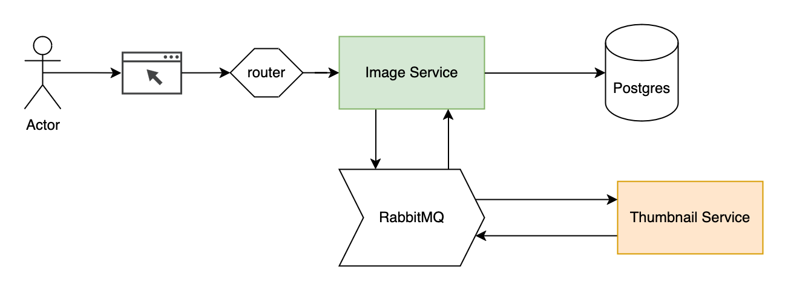

# score-eg-image-service

An example service that stores a gallery of images and uses an external service to generate thumbnails.

.

This service depends on the thumbnail service from <https://github.com/astromechza/score-eg-thumbnail-service>.



# Testing with Score Compose

## Without the thumbnail service and building the container image from source

**NOTE**: without the thumbnail service, the UI will render loading gifs in place of thumbnails.

```
$ score-compose init
$ score-compose generate score.yaml --build main=.
$ docker compose up -d --build
$ score-compose resources get-outputs 'dns.default#image-service.dns' --format "http://{{ .host }}:8080/images/ "
```

## With the thumbnail service and image override

```
$ score-compose init
$ curl https://raw.githubusercontent.com/astromechza/score-eg-thumbnail-service/main/score.yaml > score-thumbnail-service.yaml
$ score-compose generate score-thumbnail-service.yaml
$ score-compose generate score.yaml --override-property 'containers.main.image="ghcr.io/astromechza/score-eg-image-service:sha-182467a"'
$ docker compose up -d
$ score-compose resources get-outputs 'dns.default#image-service.dns' --format "http://{{ .host }}:8080/images/ "
```

## Deploying with Score Kubernetes

```
$ score-k8s init
$ score-k8s generate score-thumbnail-service.yaml score.yaml
$ kubectl apply -f manifests.yaml
```
